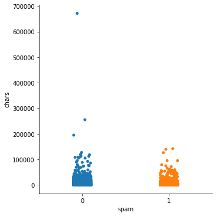
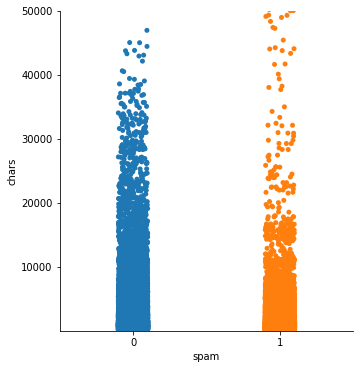
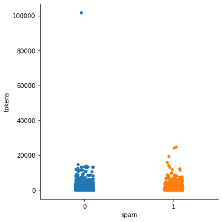
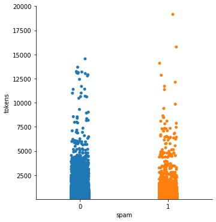
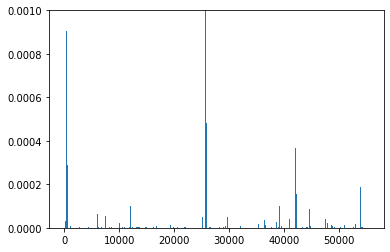

# Features


```python
import pandas as pd
from os import listdir
from os.path import isfile, join

import json
import re
from bs4 import BeautifulSoup
import email
import urllib
import base64
import string
import quopri
import time

import numpy as np

import seaborn as sns
import sklearn.utils

import nltk
from nltk.corpus import stopwords
from nltk.stem import WordNetLemmatizer
from nltk.corpus import words

from sklearn.feature_extraction.text import TfidfVectorizer
import joblib

import matplotlib.pyplot as plt

from sklearn.preprocessing import LabelEncoder
from sklearn.model_selection import train_test_split
from sklearn.pipeline import Pipeline    
from sklearn.naive_bayes import MultinomialNB
from sklearn.ensemble import RandomForestClassifier
from sklearn.neighbors import KNeighborsClassifier
from sklearn.svm import SVC
from sklearn.model_selection import cross_val_score
from sklearn.metrics import precision_score, recall_score, plot_confusion_matrix, classification_report, accuracy_score, f1_score
from sklearn import metrics
```


```python
# import dataframe
df = joblib.load("exports/dataframe.sav")
```


```python
len(df)
```


    62701


```python
df_spam = df[df["spam"] == 1]
```


```python
df_ham = df[df["spam"] == 0]
```


```python
len(df_spam)
```


    34291


```python
len(df_ham)
```


    28410


# Outliers


```python
sns.catplot(x="spam", y="chars", data=df)
```


    <seaborn.axisgrid.FacetGrid at 0x281c64bff10>


    

    


```python
len(df[df['chars'].map(lambda d: d) > 190000])
```


    3


```python
df[df['chars'].map(lambda d: d) > 190000]["raw_data"]
```


    53324    change your settings: http://blo.gs/settings.p...
    63715    On Fri Apr 27 14:43:55 2007, jkeen@verizon.net...
    75545    commit a snapshot of the generated prototype h...
    Name: raw_data, dtype: object


```python
df[df['chars'].map(lambda d: d) > 190000]["raw_data"][63715][:1000]
```


    'On Fri Apr 27 14:43:55 2007, jkeen@verizon.net wrote:\n> A file with coverage analysis will be supplied in a  \n> separate posting to this thread.\n\nAttached is a plain text version of the coverage analysis.  Coverage was run on a \'post-\nConfigure.pl\' basis:\n\n  $ cover -delete coverage/configure/\n  $ ./myconfigure.sh \n  $ PERL5OPT=-MDevel::Cover=-db,coverage/configure/ prove t/configure/*.t t/\npostconfigure/01-data_slurp.t "$@"\n  $ cover coverage/configure/ -report=text  -ignore_re \'(^(config\\/|lib\\/(?!P\narrot))|\\busr\\b)\' > ~/learn/parrot/coverage/postconfigure.coverage.txt\n\nkid51\nb\'Reading database from /Users/jimk/work/fresh/coverage/configure\\n\\n\\n---------------------------- ------ ------ ------ ------ ------ ------ ------\\nFile                           stmt   bran   cond    sub    pod   time  total\\n---------------------------- ------ ------ ------ ------ ------ ------ ------\\n/usr/local/bin/prove           73.7   43.8    0.0   46.7    n/a    1.1   61.1\\nconfig/auto/aio.pm          '


```python
# outliers are legit mails --> do not remove (e.g. someone just sent code (diff) via mail ...)
```


```python
sns.catplot(x="spam", y="chars", data=df).set(ylim=(10, 50000))
```


    <seaborn.axisgrid.FacetGrid at 0x281c64ba790>


    

    


```python
sns.catplot(x="spam", y="tokens", data=df)
```


    <seaborn.axisgrid.FacetGrid at 0x281b4370490>


    

    


```python
df[df['tokens'].map(lambda d: d) > 90000]["raw_data"]
```


    75545    commit a snapshot of the generated prototype h...
    Name: raw_data, dtype: object


```python
df[df['tokens'].map(lambda d: d) > 90000]["raw_data"][75545][:1000]
```


    'commit a snapshot of the generated prototype headers\n---\nsource/client/client_proto.h     |  366 ++\nsource/include/proto.h           |10128 ++++++++++++++++++++++++++++++ \n++++++++\nsource/nsswitch/winbindd_proto.h |  516 ++\nsource/utils/net_proto.h         |  382 ++\nsource/utils/ntlm_auth_proto.h   |   28 +\nsource/utils/passwd_proto.h      |   12 +\nsource/web/swat_proto.h          |   49 +\n7 files changed, 11481 insertions(+), 0 deletions(-)\ncreate mode 100644 source/client/client_proto.h\ncreate mode 100644 source/include/proto.h\ncreate mode 100644 source/nsswitch/winbindd_proto.h\ncreate mode 100644 source/utils/net_proto.h\ncreate mode 100644 source/utils/ntlm_auth_proto.h\ncreate mode 100644 source/utils/passwd_proto.h\ncreate mode 100644 source/web/swat_proto.h\n\ndiff --git a/source/client/client_proto.h b/source/client/client_proto.h\nnew file mode 100644\nindex 0000000..f5027e8\n--- /dev/null\n+++ b/source/client/client_proto.h\n@@ -0,0 +1,366 @@\n+#ifndef _CLIENT_PROTO_H_\n+#define _CLIENT_'


```python
# token outlier is chars outlier --> do not remove (same reason)
```


```python
sns.catplot(x="spam", y="tokens", data=df).set(ylim=(10, 20000))
```


    <seaborn.axisgrid.FacetGrid at 0x281b43b40d0>


    

    


# Feature ideas


```python
df.groupby(['spam', 'bad_domain']).size()
```


    spam  bad_domain
    0     0             27737
          1               673
    1     0             34202
          1                89
    dtype: int64


```python
# bad_domain does not seem to be a good indicator
# there are more ham mails that contain blacklisted domains than spam mails ...
```


```python
df.groupby(['spam', 'contains_urls']).size()
```


    spam  contains_urls
    0     0                 4087
          1                24323
    1     0                 8402
          1                25889
    dtype: int64


```python
# url does not seem to be a good indicator due to the balanced distribution
```

# Feature importances


```python
from matplotlib import pyplot
import math
```


```python
# import vocabulary
vocab = joblib.load("exports/vocab.sav")
# import model
model = joblib.load("exports/model.sav")
```


```python
importance = model.feature_importances_
important_features = []
most_important_feature = 0
most_important_feature_score = 0

# summarize feature importance
for i,v in enumerate(importance):
    if v > 0.005:
        print('Feature: %0d, Score: %.5f' % (i,v))
        important_features.append(i)
        if v > most_important_feature_score:
            most_important_feature_score = v
            most_important_feature = i
        
x = [x for x in range(len(importance))]
y = importance
low = min(y)
high = max(y)
```

    Feature: 9580, Score: 0.00761
    Feature: 9927, Score: 0.00622
    Feature: 10659, Score: 0.00542
    Feature: 12432, Score: 0.00690
    Feature: 18301, Score: 0.00679
    Feature: 21466, Score: 0.00605
    Feature: 28685, Score: 0.01183
    Feature: 28883, Score: 0.00554
    Feature: 29700, Score: 0.01102
    Feature: 29707, Score: 0.01902
    Feature: 31527, Score: 0.00824
    Feature: 33864, Score: 0.00785
    Feature: 36794, Score: 0.00566
    Feature: 37743, Score: 0.00727
    Feature: 38157, Score: 0.00581
    Feature: 38699, Score: 0.00635
    Feature: 39212, Score: 0.00623
    Feature: 40365, Score: 0.00501
    Feature: 41407, Score: 0.00730
    Feature: 52312, Score: 0.00990
    Feature: 54730, Score: 0.01390
    Feature: 55305, Score: 0.00521
    Feature: 55306, Score: 0.00907
    


```python
# plot feature importance
pyplot.ylim([low, 0.001])

pyplot.bar(x, y)
pyplot.show()
```


    

    


```python
high
```


    0.01901974325590954


```python
low
```


    0.0


```python
important_features
```


    [9580,
     9927,
     10659,
     12432,
     18301,
     21466,
     28685,
     28883,
     29700,
     29707,
     31527,
     33864,
     36794,
     37743,
     38157,
     38699,
     39212,
     40365,
     41407,
     52312,
     54730,
     55305,
     55306]


```python
list(vocab)[most_important_feature]
```


    'felix'


```python
most_important_feature_score
```


    0.01901974325590954


```python
firstIndexError = True
for f in important_features:
    try:
        print(list(vocab)[f])
    except IndexError:
        if firstIndexError:
            print(f, "(#tokens)")
            firstIndexError = False
        else:
            print(f, "(#chars)")
```

    summit
    sidecar
    cranford
    asem
    nerds
    pullen
    uec
    ipo
    polity
    felix
    patroclus
    shelley
    unconquered
    incipient
    caliber
    momentarily
    rashid
    topics
    tyrant
    omm
    apiology
    55305 (#tokens)
    55306 (#chars)
    


```python
# char size and tokens size seem to be good indicator according to feature_importances_
```
